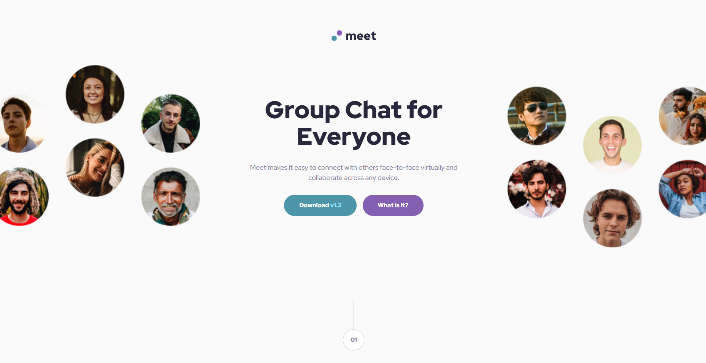
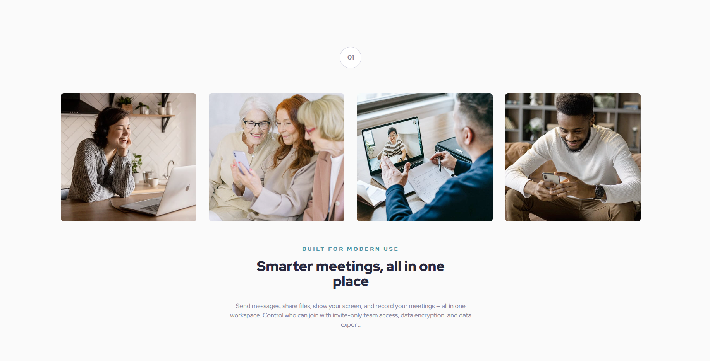
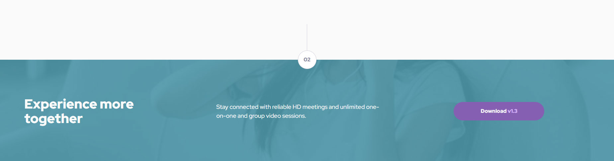

🤝 Meet Landing Page

A responsive Meet Landing Page built as part of a Frontend Mentor challenge.
The project focuses on creating a modern UI with structured sections, clean layout, and responsive design.

🚀 Features

- Modern landing page layout
- Hero section with headline and CTA
- Feature/benefits section
- Call-to-action buttons
- Responsive layout (mobile → desktop)
- Clean typography and spacing

| Technology             | Purpose                 |
| ---------------------- | ----------------------- |
| **HTML5**              | Semantic page structure |
| **CSS3**               | Styling and layout      |
| **Flexbox / CSS Grid** | Layout alignment        |
| **GitHub Pages**       | Deployment              |

📸 Sections

Hero Section

About Section

Footer Section

